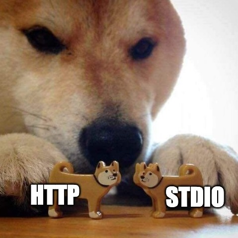

httpipe
=======
http <-> stdio bridge inspired by <https://github.com/openfaas/faas>.

Summary
-------
- each function gets a subdirectory
- on GET request, it displays a `doc` file
- on POST request, it runs `handle` executable
- `handle` reads HTTP request body as stdin
- anything that `handle` writes to stdout is sent as HTTP response
- anything that `handle` writes to stderr is appended to `log` file with a timestamp
- every invocation increments `runs` file with a timestamp

Extras
------
- caching of (md5-checksummed) input can be handled by `contrib/memoize` script
- piping works by calling `/pipe/{funcs}` endpoint
- you can spawn a container for process by replacing normal shebang with `contrib/cr`

Example
-------
Invoke:

    $ envdir ./env ./httpipe  # or...
    $ HTTPIPE_DIR=fn ./httpipe  # or...
    $ ./httpipe -d fn

The simplest use case is with strings:

    $ cat ./fn/b64e/handle
    #!/bin/sh -e
	base64

	$ curl -d "hello world" 0.0.0.0:8080/b64e
	aGVsbG8gd29ybGQ=

	$ curl -d "aGVsbG8gd29ybGQ=" 0.0.0.0:8080/b64d
	hello world%

	$ curl -d "hello world=" 0.0.0.0:8080/pipe/b64e/b64d
	hello world%

    $ cat ./fn/bw/handle
    #!/bin/sh -e
    convert - -grayscale Rec709Luminance fd:1

    $ curl --data-binary @./meme.jpg 0.0.0.0:8080/bw > meme_bw.jpg # or...
    $ < ./meme.jpg curl --data-binary @- 0.0.0.0:8080/bw > ./meme_bw.jpg

